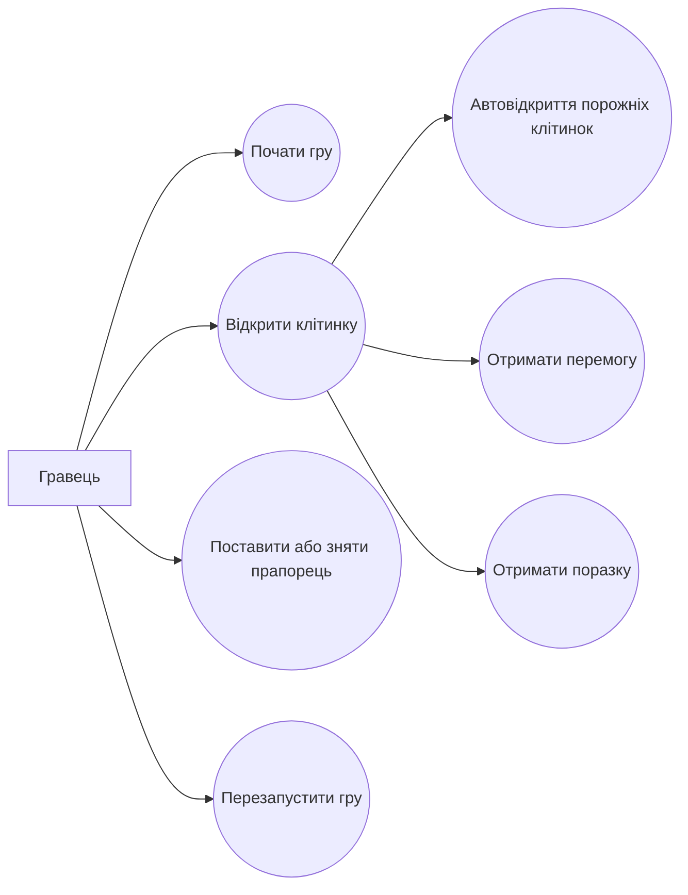

# Аналіз гри

## Короткий опис

"Сапер" це логічна гра, у якій гравець відкриває клітинки поля та уникає мін. Число в клітинці показує кількість мін у сусідніх клітинках. Мета гри: відкрити всі безпечні клітинки.

## Основні варіанти використання

- Почати нову гру.
- Відкрити клітинку.
- Поставити або зняти прапорець.
- Автоматично відкрити порожню область.
- Отримати повідомлення про перемогу.
- Отримати повідомлення про поразку.
- Перезапустити партію.

## Діаграма варіантів використання

## Функціональні вимоги

- Ігрове поле має створюватися з фіксованими розмірами.
- На полі має бути фіксована кількість мін.
- Гравець має відкривати клітинки лівою кнопкою миші.
- Гравець має ставити прапорці правою кнопкою миші.
- Після відкриття міни гра завершується поразкою.
- Після відкриття всіх безпечних клітинок гра завершується перемогою.

## Нефункціональні вимоги

- Гра має запускатися локально на ПК.
- Інтерфейс має бути простим і зрозумілим.
- Логіка поля має бути придатною до модульного тестування.

