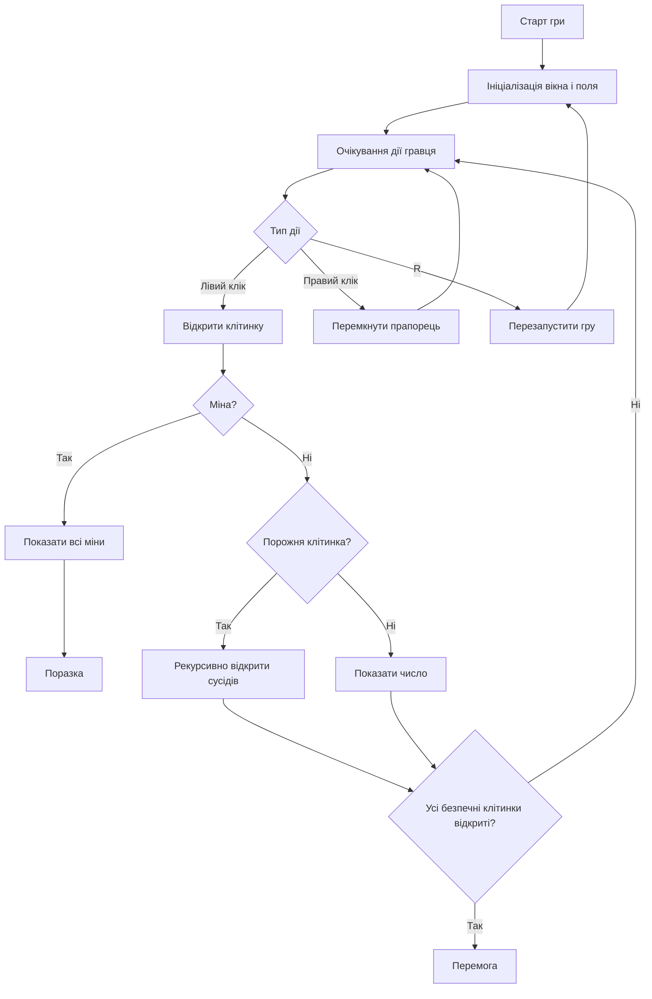
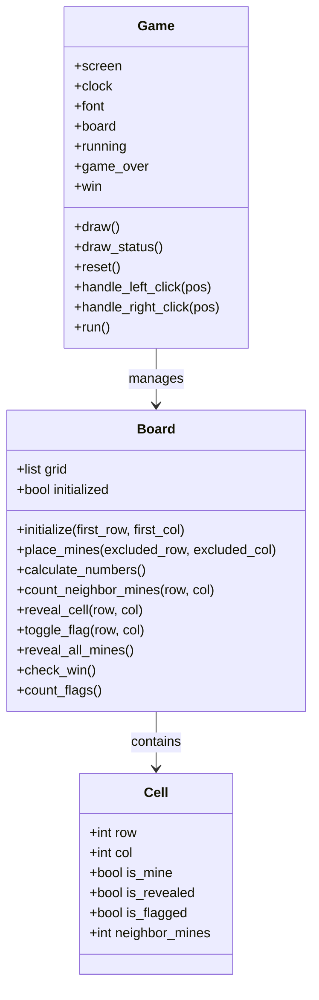

# Проєктування гри

## Діаграма діяльності

## Діаграма класів

## Короткі проєктні рішення

- `Cell` зберігає лише стан однієї клітинки.
- `Board` відповідає за всю ігрову логіку та перевірки.
- `Game` відповідає за `pygame`, події та відображення.
- Ініціалізація мін відкладена до першого ходу, щоб перший клік був безпечним.

